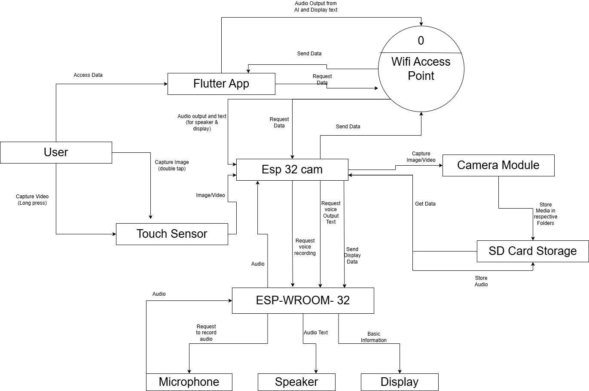

# Smart-Glass---Intelligent-Wearable-Vision-System (Offline Edge AI System).

A fully offline smart glass system that integrates embedded hardware and mobile-assisted AI to enable real-time vision, speech recognition, and translation without internet dependency.

---

## Features

- Fully offline operation (no cloud dependency)
- Dual ESP32 architecture (camera + control)
- Mobile-assisted AI inference pipeline
- On-device ASR (speech-to-text) and translation
- Designed for low latency and resource-constrained environments

---

## System Architecture

**Pipeline:**
ESP32-CAM → captures image/audio  
→ sent to mobile device for AI inference  
→ processed output returned to ESP32-WROOM  
→ displayed or used for action

---

## Tech Stack

- **Hardware:** ESP32-CAM, ESP32-WROOM
- **Languages:** Embedded C
- **Computer Vision:** OpenCV
- **AI Models:** Lightweight ASR (Vosk / Whisper - explored), Translation models
- **Mobile:** Flutter (for media access, interface & local computation)

---

## Key Highlights

- Designed a **distributed embedded system** to overcome hardware limitations
- Implemented **edge AI pipeline** with mobile as compute unit
- Focused on **low latency, memory efficiency, and real-time processing**

---

## Challenges

- Limited memory and compute on ESP32
- Latency trade-offs in mobile inference
- Model size vs accuracy optimization

---

## Future Work

- Optimize ASR models for faster inference
- Improve real-time responsiveness
- Integrate additional sensors and feedback systems

---

## Status

🚧 Work in Progress
